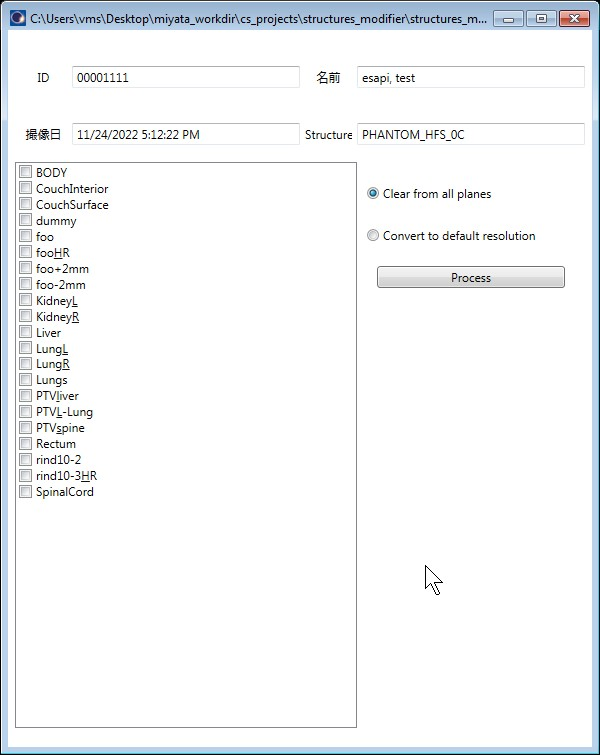

# structures_modifier_esapi_v15_5

Structure を空に（Delete ではなくClear）したり、High resolution の Structure を Default resolution に変換するための ESAPI Binary Plugin です。

本ソフトウェアの多言語への翻訳は途中です。

## 使用方法

処理したい Structure Set を開いた状態で、Tools > Scripts から structures_modifier_esapi_v15_5.esapi.dll を実行します。

上記のような画面が表示されますので、処理したい Structure にチェックを入れ、

- Clear from all planes (すべての断面から contour を削除する)
- Convert to default resolution

のどちらかを選択し、"Process" ボタンをクリックします。

## ライセンス

MIT ライセンスで公開されています。

本ソフトウェアで発生したことについて、いかなる責任も負いません。

詳細は [LICENSE](https://github.com/akiaji-k/plan_checker_gui_esapi_v15_5/blob/main/LICENSE) をご確認ください。

